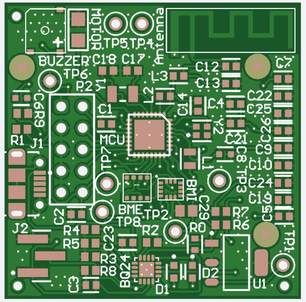
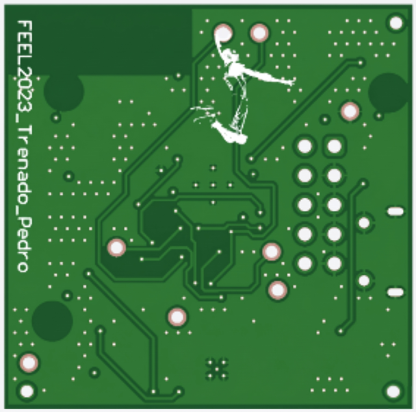

# EyeGAIT — Monitoring Device for Parkinson's Patients

> Academic project developed at the Department of Electronic Engineering  
> Universidad Politécnica de Madrid — Electronic Equipment Manufacturing (FEEL)

---

## Description

EyeGAIT is an **intelligent smart insole** designed to monitor patients with Parkinson's disease, aiming to assist in the early detection and personalized treatment of gait disorders.

The Spanish Society of Neurology (SEN) estimates that the number of affected individuals will double within 20 years and triple by 2050, making wearable devices like this one a highly valuable clinical tool.

---

## System Architecture

The system is composed of the following modules:

| Module | Component | Function |
|---|---|---|
| Microcontroller | CC2640R2F | Central processing + RF (Bluetooth Low Energy) |
| IMU | BMI323 | Accelerometer, magnetometer, gyroscope (SPI) |
| Environmental sensor | BME680 | Temperature, humidity, pressure, gas (SPI/I2C) |
| Battery management | BQ24232 | LiPo battery charger |
| Voltage regulator | AP7361-33E | Linear regulator 3.3V / 1A |
| Actuators | Motor + Buzzer | Haptic and audio feedback (PWM) |
| Communication | USB Micro-B | Programming and charging |
| Oscillators | 32.768 kHz + 24 MHz | RTC and main clock |

---

## PCB

### Manufacturing Specifications

| Parameter | Value |
|---|---|
| Base material | FR-4 Standard TG 135–140 |
| Number of layers | 4 |
| Dimensions | 35 × 35 mm |
| Thickness | 1.6 mm |
| Solder mask color | Green |
| Silkscreen | White |
| Surface finish | HASL (with lead) |
| Outer copper weight | 1 oz |
| Inner copper weight | 0.5 oz |
| Min via (hole/pad) | 0.3 mm / 0.45 mm |
| Via covering | Tented |
| Board outline tolerance | ±0.2 mm |
| Impedance control | No |
| Gold Fingers | No |

### PCB Views

| Top Layer | Bottom Layer |
|---|---|
|  |  |

> Designed in Altium Designer. PCB ID: `FEEL2023_Trenado_Pedro`

---

## BOM (Bill of Materials) — Summary

| Qty | Component | Reference | Description |
|---|---|---|---|
| 1 | CC2640R2FRHB | MCU | TI BLE Microcontroller |
| 1 | BMI323 | BMI | 6-axis IMU |
| 1 | BME680 | BME | 4-in-1 sensor (T, H, P, Gas) |
| 1 | BQ24232 | BQ24 | LiPo battery charger |
| 1 | AP7361-33E | U1 | 3.3V linear regulator |
| 1 | SMD Buzzer | BUZZER | Surface mount buzzer |
| 1 | Motor | MOTOR | Vibration motor |
| 1 | USB Micro-B | J1 | USB connector |
| 10 | 100 nF / 0603 | C2,C4,C5… | Decoupling capacitors |
| 3 | 4.7 µF / 0603 | C3,C19,C24 | Filter capacitors |
| 2 | 10 µF / 0603 | C6,C8 | Bulk capacitors |
| 8 | Test Points | TP1–TP8 | DFT test points |
| 2 | Green LED | D1,D2 | Status indicators |
| 2 | Crystal | Y1,Y2 | 32.768 kHz + 24 MHz |
| ~10 | Resistors 0603 | R1–R9 | Various values |
| 2 | 180 nH inductors | L2,L3 | RF filters |
| 1 | 10 µH inductor | L1 | Regulator filter |

Full BOM available at [`/hardware/BOM.pdf`](hardware/BOM.pdf)

---

## PRD (Product Requirements Document)

| Requirement | Value |
|---|---|
| DFT | Accessible test points |
| Size | 35 × 35 mm (target: 30 × 30 mm) |
| Battery life | 1 day – 1 week |
| Operating temperature | 0 °C – 65 °C |
| Target sales volume | Hundreds of thousands of units |
| Target cost | €10 – €20 |
| Time to market | 4 months |
| Certifications | CE |

---

## Repository Structure

```
EyeGAIT/
├── hardware/
│   ├── BOM.pdf
│   ├── schematic/
│   ├── pcb/
│   └── gerbers/
├── docs/
│   ├── pcb_top.png
│   ├── pcb_bottom.png
│   └── FEEL-01-propuesta_proyecto.pdf
└── README.md
```

---

## Team

Project developed for the course **Electronic Equipment Manufacturing (FEEL)**  
Department of Electronic Engineering — Universidad Politécnica de Madrid  
Author: Pedro Trenado

---

## License

This project is for academic use only. 
